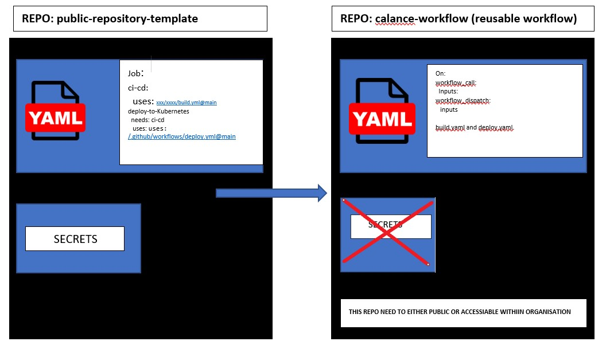
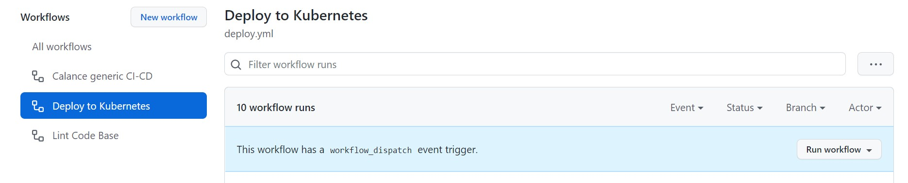
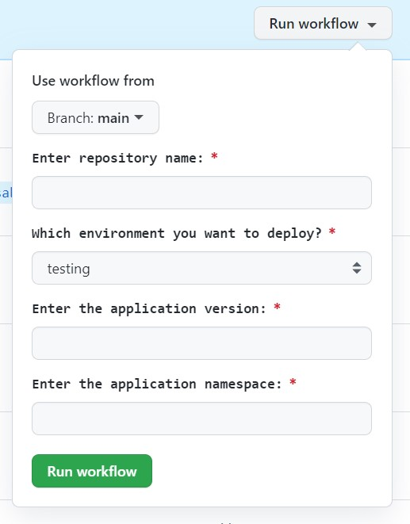
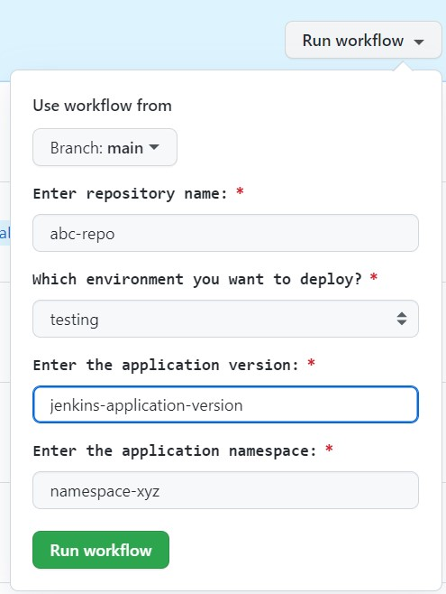

# :black_nib: reusable workflow

*This repository is used to build a docker image, push it repository and deploy to kubernetes cluster using jenkins job.*

## :loop: Workflow

*We are using the workflow created in calance-workflow from another repository*


## :baby: Requirements and Dependencies

    * Jenkins 

## :cyclone: Environment variables

    * JENKINS_TOKEN
    * JENKINS_URL
    * JENKINS_USER

    **INPUT VARIABLES**

    * repository_name
    * version
    * cluster_environment

## :tada: Running the project

*How To Trigger This Workflow*

## Manually

**In manual you have you have provide input, this process is made to ease deployment and to re-deployment to previous version**

*Below diagram gives you how to trigger this workflow*

*Click on Action and select option Deploy-to-Kubernetes*



*Click on Run workflow on right*



*place your input selecting through which branch you want to run the deployment*



**Trigger from current repository**

*This workflow will trigger on push of new tags to the repository after you make change to your code and push is to the branch*

```bash
*$ git add <file-name>*

*$ git commit -m "message"*

*$ git push*

*$ git tag v1.0.1*

*$ git push --tags*
```

## **Reusing-Workflow from another repository (caller)**

*This workflow will trigger on push of new tags to the repository*

*Commands to create and push tags*

```bash
*$ git tag v1.0.1*

*$ git push --tags*
```

## :flashlight: Testing

*Tested via public-templated-repository*

*created a build.yaml file*

## :information_desk_person: Contributors

Want to reach out to the folks who have tirelessly worked on this project, please reach out to the following folks.

*The entire purpose of the workflow is to build jenkins job from GitHub action, for this we have used GoldenspearLLC/build-jenkins-job which is created by [GoldenSpear](https://github.com/GoldenspearLLC/build-jenkins-job)*

**Project Manager/s:**

- [Arpit Goyal](https://github.com/agoyalcalance)

**Developer/s:**

- [Prem Pratap Singh](https://github.com/ppsinghcalance)
- [Nilesh Mathur](https://github.com/nmathur478)
