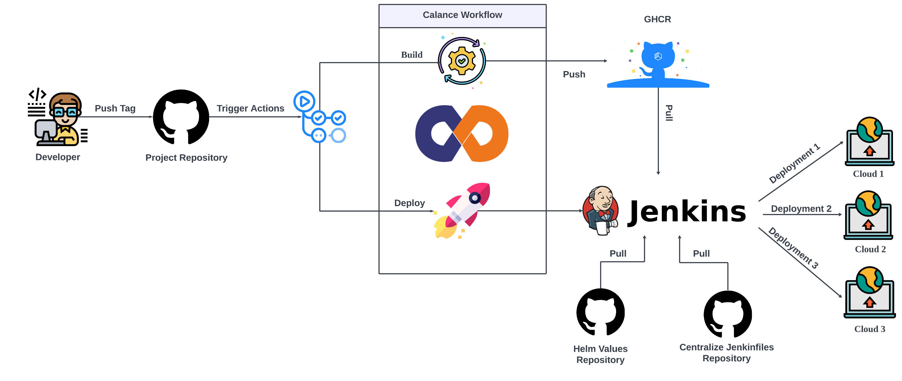

# Reusable Workflows Repository: Streamlining CI/CD Processes
# :black_nib: Introduction

**Welcome to the Reusable Workflows repository!**


This repository serves as a centralized hub for all reusable workflows essential for CI/CD processes. Whether you're building Docker images, deploying applications to Kubernetes Cluster, or orchestrating deployments on AWS EC2 instances, you'll find the necessary workflows and guidelines here to streamline your development pipeline.

Explore the sections below to understand the workflows available, their requirements, and how to effectively utilize them in your projects.

Let's dive in and empower your development journey with our reusable workflows!

# :earth_asia: Content
- [Workflows Mechanism](#runner-workflows-mechanism)
- [Requirements and Dependencies](#baby-requirements-and-dependencies)
- [Environment Variables](#cyclone-required-environment-variables)
- [Parameters](#inbox_tray-parameters)
- [Outputs](#outbox_tray-outputs)
- [Examples](#mag_right-examples)
- [Contributor/s](#information_desk_person-contributors)

## :runner: Workflows Mechanism


## :baby: Requirements and Dependencies

* `Jenkins`
* `Node/Cloud configured on Jenkins` (For configuring the node/cloud on Jenkins, check [here](https://docs.calance.work/en/calance/devops/Jenkins-Agent-As-Service-On-Node))

## :cyclone: Required Environment Variables

**For building the docker image of the applications and pushing it to the Image Registry:**

| Variable | Description |
| --- | --- |
| IMAGE_REGISTRY_PASSWORD   |  Password for accessing Image Registry |

**For applications getting deployed on Kubernetes Clusters:**

| Variable | Description |
| --- | --- |
| JENKINS_URL   |  URL of Jenkins Server |
| JENKINS_USER   |  Authorized User for accessing Jenkins Server   |
| JENKINS_TOKEN   | Token for accessing Jenkins Server   |
| SMTP_PASSWORD   |    SMTP Server Password for Notifying about pipelines | 


**For applications getting deployed on AWS EC2 Instances:**

| Variable | Description |
| --- | --- |
| JENKINS_URL   |  URL of Jenkins Server |
| JENKINS_USER   |  Authorized User for accessing Jenkins Server   |
| JENKINS_TOKEN   | Token for accessing Jenkins Server   |
| SMTP_PASSWORD   |    SMTP Server Password for Notifying about pipelines |
| AWS_ACCESS_KEY_ID | AWS Access Key for the User for accessing the instance | 
| AWS_SECRET_ACCESS_KEY  | AWS Secret Key for the User for accessing the instance |

## :inbox_tray: Parameters

**For building the docker image of the applications and pushing it to the Image Registry:**

| Parameter | Description | Required | Default Value |
| --- | --- | --- | --- |
| docker_context_path | Docker Context Path | False | . |
| dockerfile_path | Path of Dockerfile | False | ./Dockerfile |
| image_name | Name of docker image | True | . |
| dot_env_file_testing | Build time environment variables as multiline string for testing environment | False | "" |
| dot_env_file_production | Build time environment variables as multiline string for production environment | False | "" |
| dot_env_file_dev | Build time environment variables as multiline string for dev environment | False | "" |
| branch_name | The branch we are going to build. If kept empty,**git ref**, that triggered the workflow is used | False | "" |
| image_registry | Name of image registry | True | - |
| image_registry_username | Username of image registry | True | - |

**For applications getting deployed on Kubernetes Clusters:**

| Parameter | Description | Required | Default Value |
| --- | --- | --- | --- |
| repository_name   |  Name of the repository | True | - |
| image_name | Name of the docker image | True | - |
|release_name | Application release name | False | ${{ github.event.repository.name }} |
|service_name | Application service name | False | ${{ github.event.repository.name }} |
|cluster_environment | Environment to deploy the image | True | - |
| version | Version of the application | True | - |
| commit_id | Latest commit sha of the build | True | - |
| env_specific_namespaces | Enable generating namespace value according to the cluster-environment | False | false |
| image_registry | Name of image registry | True | - |
jenkins_job_name | Name of Jenkins job name | True | - |
| workflows_release | Workflows Release Version of current deployment | True | - |
| helm_values_repository | Name of repository that has helm values files | True | - |
| codeowners_email_ids | Email-ID of CodeOwner/s (If multiple codeowners, seperate email IDs with comma) | True | - |
  
**For applications getting deployed on AWS EC2 Instances:**

| Parameter | Description | Required | Default Value |
| --- | --- | --- | --- |
| image_name | Name of the docker image | True | - |
|release_name | Application release name | True | - |
|service_name | Application service name | False | ${{ github.event.repository.name }} |
|cluster_environment | Environment to deploy the image | True | - |
| version | Version of the application | True | - |
| image_registry | Name of image registry | True | - |
jenkins_job_name | Name of Jenkins job name | True | - |
| workflows_release | Workflows Release Version of current deployment | True | - |
| codeowners_email_ids | Email-ID of CodeOwner/s (If multiple codeowners, seperate email IDs with comma) | True | - |
| credentials_id | Credentials ID for pulling image from Image Registry defined in Jenkins Credentials Store | True | - |
| command | Command for starting the application | False | - |
| port | Port at which service will be running | False | - |
| aws_region | AWS region name | False | - |
| docker_network | Name of docker network | True | - |
| mount_path | Mount Path (For multiple volume mounts, add a comma seperated string) | False | - |
| enable_gpu | Enable if container requires GPU | False | - |
| log_driver | Logging Driver of Container | False | - |
| log_driver_options | Log Driver Options (For multiple log driver options, add a comma seperated string) | False | - |

## :outbox_tray: Outputs

Upon successful execution of the workflow to build the Docker image, the following environment variables are returned:

* `version:` Version of the application
* `cluster_environment`: Environment to deploy the image
* `image_name`: Name of the docker image
* `commit_id`: Latest commit sha of the build

You can utilize these output variables in subsequent steps or workflows for further processing or deployment.

## :mag_right: Examples

The workflow for building the application's docker image and deploying it to **Kubernetes Cluster** will look like this:

```yaml
name: CI/CD Pipeline for applications getting deployed on Kubernetes Cluster
on:
  push:
    tags:
    - v[0-9]+.[0-9]+.[0-9]+-rc[0-9]+
    - v[0-9]+.[0-9]+.[0-9]+

jobs:
  build-and-push-dockerimages:
    strategy:
      fail-fast: false
    permissions:
      contents: read
      packages: write
    uses: Calance-US/calance-workflows/.github/workflows/build.yml@v2.0.0
    with:
      image_name: my-application
      image_registry: ${{ vars.IMAGE_REGISTRY }}
      image_registry_username: ${{ vars.IMAGE_REGISTRY_USERNAME }}
    secrets:
      IMAGE_REGISTRY_PASSWORD: ${{ secrets.IMAGE_REGISTRY_PASSWORD }}

  deploy-to-kubernetes:
    needs: build-and-push-dockerimages
    strategy:
      fail-fast: false
    permissions:
      contents: read
      packages: write
    uses: Calance-US/calance-workflows/.github/workflows/deploy.yml@v2.0.0
    with:
      repository_name: ${{ github.event.repository.name }}
      version: ${{ needs.build-and-push-dockerimages.outputs.version }}
      release_name: my-application-release-name
      image_name: my-application
      cluster_environment: ${{ needs.build-and-push-dockerimages.outputs.cluster_environment }}
      commit_id: ${{ needs.build-and-push-dockerimages.outputs.commit_id }}
      image_registry: ${{ vars.IMAGE_REGISTRY }}
      jenkins_job_name: job-name
      release_tag: v2.0.0
      helm_values_repository: helm-values-repo
    secrets:
      JENKINS_URL: ${{ secrets.JENKINS_URL }}
      JENKINS_USER: ${{ secrets.JENKINS_USER }}
      JENKINS_TOKEN: ${{ secrets.JENKINS_TOKEN }}
```
The workflow for building the application's docker image and deploying it to **AWS EC2 instances** will look like this:

```yaml
name: CI/CD Pipeline for applications getting deployed on AWS EC2 Instances
on:
  push:
    tags:
      - v[0-9]+.[0-9]+.[0-9]+-rc[0-9]+
      - v[0-9]+.[0-9]+.[0-9]+

jobs:
  ci-cd:
    uses: Calance-US/calance-workflows/.github/workflows/build.yml@v2.0.0
    with:
      image_name: my-application
      image_registry_username: ${{ vars.IMAGE_REGISTRY_USERNAME }}
      image_registry: ${{ vars.IMAGE_REGISTRY }}
    secrets:
      IMAGE_REGISTRY_PASSWORD: ${{ secrets.IMAGE_REGISTRY_PASSWORD }}

  deploy-to-kubernetes:
    needs: ci-cd
    strategy:
    uses: Calance-US/calance-workflows/.github/workflows/deploy-on-ec2.yml@v2.0.0
    with:
      image_name: my-application
      image_registry: ${{ vars.IMAGE_REGISTRY }}
      credentials_id: ${{ vars.CREDENTIALS_ID }}
      release_name: my-application-name
      version: ${{ needs.ci-cd.outputs.version }}
      cluster_environment: ${{ needs.ci-cd.outputs.cluster_environment }}
      port: ${{ vars.PORT }}
      command: ${{ vars.COMMAND }}
      aws_region: ${{ vars.AWS_REGION }}
      docker_network: otsuka
      mount_path: /home/ubuntu/:/app/
      jenkins_job_name: job-name
      release_tag: v2.0.0
    secrets:
      JENKINS_URL: ${{ secrets.JENKINS_URL }}
      JENKINS_USER: ${{ secrets.JENKINS_USER }}
      JENKINS_TOKEN: ${{ secrets.JENKINS_TOKEN }}
      AWS_ACCESS_KEY_ID: ${{ secrets.AWS_ACCESS_KEY_ID }}
      AWS_SECRET_ACCESS_KEY: ${{ secrets.AWS_SECRET_ACCESS_KEY }}
```

## :information_desk_person: Contributors

Want to reach out to the folks who have tirelessly worked on this project, please reach out to the following folks:

**Project Manager/s:**

- [Arpit Goyal](https://github.com/agoyalcalance)
- [Nitin Kumar Kashyap](https://github.com/Nkashyap-calance)

**Developer/s:**

- [Nilesh Mathur](https://github.com/nmathur478)
